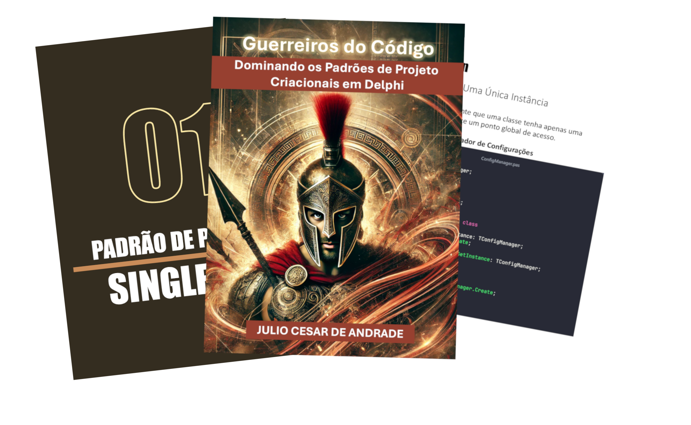

    

-------

# Projeto EBOOK Gerado por I.A.s

 > ℹ️ **NOTE:** Este é o repositório desenvolvido durante o curso Fundamentos de IA para Devs na plataforma da [DIO](https://dio.me)

Projeto com o objetivo de gerar um ebook digital com as facilidades das ferramentas de IA. todos os prompts
seguem abaixo.

<a href="https://github.com/juliocandrade/prompts-recipe-to-create-a-ebook/blob/main/output/ebook%20-%20guerreiros%20do%20codigo%20output.pdf" title="View PDF now"> 📕Clique aqui para ler</a>

## 💻 Tecnologias utilizadas no projeto

- [ChatGPT](https://chatgpt.com/) 
- [DALL·E 3](https://openai.com/index/dall-e-3/)
- [PowerPoint](https://www.microsoft.com/en/microsoft-365/powerpoint)
- [Showcode.app](https://showcode.app/)

## 🧠 Prompts

ChatGPT：

|   Ação   | prompt                                                                                                                                                                                                                                                                                     |
| :------: | ------------------------------------------------------------------------------------------------------------------------------------------------------------------------------------------------------------------------------------------------------------------------------------------ |
|  título  | Crie um título de um ebook sobre o tema de padrões de projeto, o ebook é do nicho de programação na linguagem delphi e o subnicho é de Padrões Criacionais o título deve ser épico e curto e tenha uma temática de soldados espartanos no título, me liste 5 variações de títulos           |
| conteúdo | Faça um texto para ebook, com foco em padrões de projeto, listando os padrões criacionais com exemplos de código em Delphi {REGRAS} Explique sempre de maneira simples Deixe o texto enxuto Sempre traga exemplos de código em contextos reais Sempre deixe um título sugestivo por tópico |

DALL·E 3：

|  Ação  | prompt                                                                              |
| :----: | ----------------------------------------------------------------------------------- |
| título | A portrait photo of a Spartan warrior in battle mixed with creative design patterns |

## ✨ Features

- Conteúdo gerado via ChatGPT
- Imagens geradas via DALL·E 3
- Imaegns do código geradas pelo Showcode.app

## 📚 Materiais

- Imagens utilizadas em `assets`
- ebook gerado durante as aulas em `output`

## 🛠️ Instruções de execução

Utilize os prompts acima nas ferramentas sugeridas para gerar o material base e utilize uma ferramenta de edição de documentos como power point, libreoffice , indesign para diagramação.

## 👨‍💻 Autor

    
    
&nbsp&nbsp&nbspJulio Cesar 
    &nbsp&nbsp&nbsp
    <a href="https://github.com/juliocandrade">
    GitHub</a>&nbsp;|&nbsp;
    <a href="https://www.linkedin.com/in/juliocandrade">
    LinkedIn</a>
&nbsp;|&nbsp;
    <a href="https://www.instagram.com/julio.c.andrade">
    Instagram</a>
&nbsp;|&nbsp;

  

